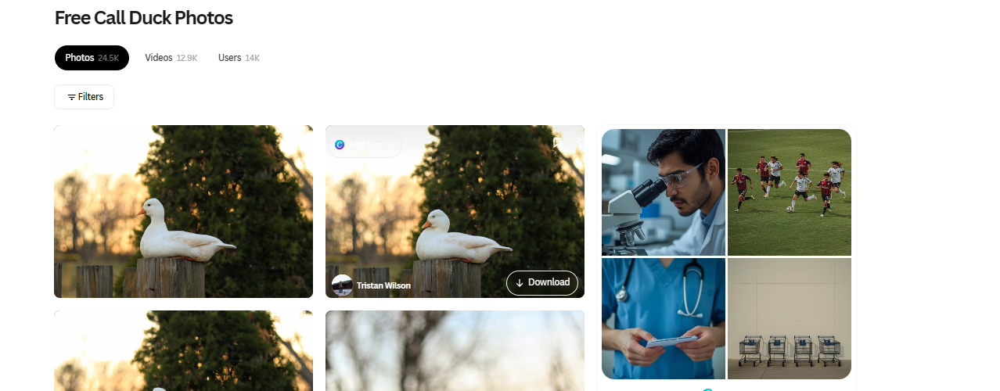
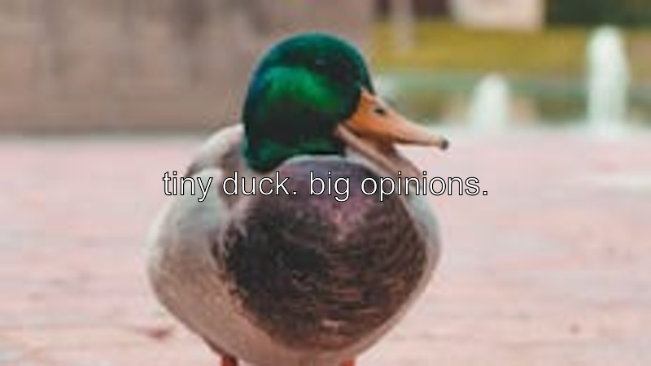

```{r setup, include=FALSE}
knitr::opts_chunk$set(echo=TRUE, message=FALSE, warning=FALSE, error=FALSE)
library(tidyverse)
selected_photos <- read_csv("selected_photos.csv")
```

```{css echo=FALSE}
body {
  background-color: skyblue;
}
a {
  color: red;
}

```

## Introduction

The search word that I used is call and ducks. I have chosen call ducks as my search word because these little creatures has been in my feed for a while. From what I can see from search is that there are many photos that are landscape, it seems that the photos are captured in some sort of park. When I clicked on the image there are usually more than 5 likes. The main colours are green, blue and white.

```{r}
selected_photos %>%
  select(url) %>%
  knitr::kable()
```
### 
### [link to site](https://www.pexels.com/search/call%20duck/)

## Key features of my selected photos

```{r}
mean_ratio <- round(mean(selected_photos$aspect_ratio, na.rm=T),1)

count_photos <- nrow(selected_photos)

max_name_length <- max(selected_photos$photographer_length)

long_name <- selected_photos %>%
  filter(nchar(photographer) == max(nchar(photographer))) %>%
  select(photographer) %>%
  pull()

min_ratio <- round(min(selected_photos$aspect_ratio, na.rm=T),2)
```

I have chosen `r count_photos` images for this analysis.  
The images have an mean aspect ratio of `r mean_ratio`.  
The smallest aspect ratio is `r min_ratio`.  
The photographer with the longest name is `r long_name`, with a total character length of `r max_name_length`.

## Creativity



This image above is created. The think process I had in mind was if I should create a gif or a png. I initially thought of doing a gif showcasing my gooses but thought perhaps other students may have the same idea. An idea popped in my head and is like why don't we just create a png that changes each time the program executes. I went and explored different R functions that may help and the one that I liked is sample() because this is very similar to a python function which returns a random number. I had used this to select a random row from the csv and got my image. I had also used this to select a random text that I generated/taken inspiration from other memes and also using it on gravity. This would allow my image to first be random, second have some type of caption and finally a random spot for the text to be placed.

p.s The png will only change if rerunning the exploration.R file 

## Learning reflection
One thing I learnt was how api was used. I wasn't a fan of api because I didn't really understand what the purpose of using an api is. This taught me that api is really helpful when combined with other functions like httr and fromJSON allowed us to create a string of helpful information. It allowed me to also learn about how to read json formats as I wasn't quite familiar on reading these long strings.
A data technology that I'm curious is Databases. Like how we would use it to help collect insightful information about something

## Appendix

```{r file='exploration.R', eval=FALSE, echo=TRUE}

```

```{r file='project3_report.Rmd', eval=FALSE, echo=TRUE}

```
