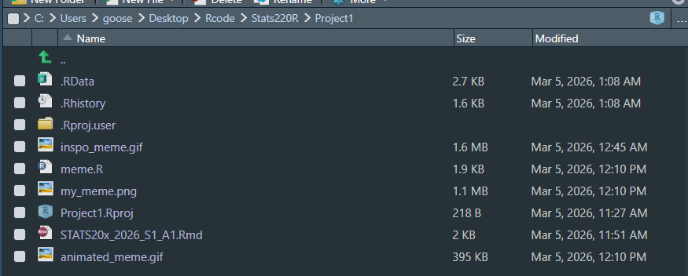
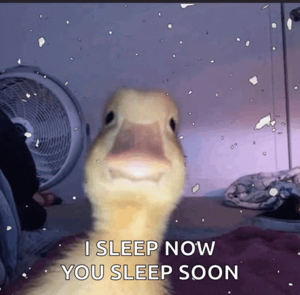
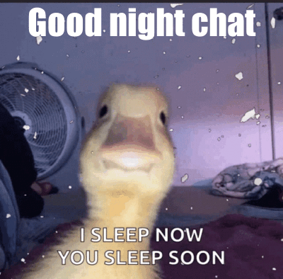
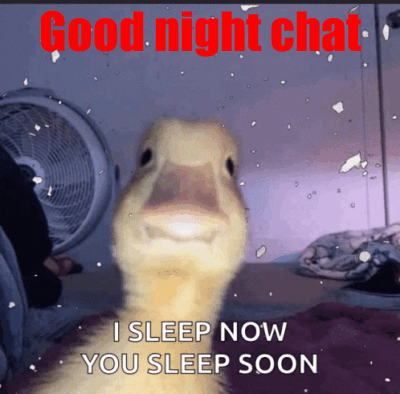

```{r setup, include=FALSE}
knitr::opts_chunk$set(echo=TRUE, message=FALSE, warning=FALSE, error=FALSE)
```

```{css}
body {
  background-color: lightblue;
}
h1, h2 {
  text-align: center;
  font-style: Sans-serif;
  font-weight: bold;
}
p {
  font-style: italic;
}
```

## Project requirements

 [A link to a github](https://github.com/gooosey/stats220)

## Inspo meme

Personally, I chose this meme because it reminds me of how much sleep I used to have back in high school. I like how the text says, “I sleep now, you sleep soon.” There could not have been a better phrase than this, as it symbolizes how my friends and I used to game and talk until we were tired.



## My meme

The change I added was putting white text at the top of the GIF saying “Good night chat” as we sign out. My reason for adding it is that the GIF felt a bit bland, like it felt like we should also include something on the top.



## My animated meme



## Creativity

I have added some styles for the html page. When I first open the page it just looks like a page that I wouldn't even click on. I have added a light blue background , changed title, headings and paragraph styles to match something a bit "modern". I have also used a new function called blur from the magick package this function makes my image blurry and it matches the sleep theme I was going for.

## Learning reflection

One really important idea that t've learnt is markdown. This is my first time actually properly trying/applying it in a markdown file. I used to always just have my markdown files completely unorganized what I mean by unorganized is that there was only one heading and rest were just paragraphs.

The next thing im curious about is if we are going to learn about databases.

ps I can't think of much of what im actually curious about I haven't been exposed to much data technologies

## Appendix

<mark>Do not change, edit, or remove the `R` chunk included below.</mark>

If you are working within RStudio and within your Project1 RStudio project (check the top right-hand corner says "Project1"), then the code from the `meme.R` script will be displayed below.

This code needs to be visible for your project to be marked appropriately, as some of the criteria are based on this code being submitted.

```{r file='meme.R', eval=FALSE, echo=TRUE}

```
