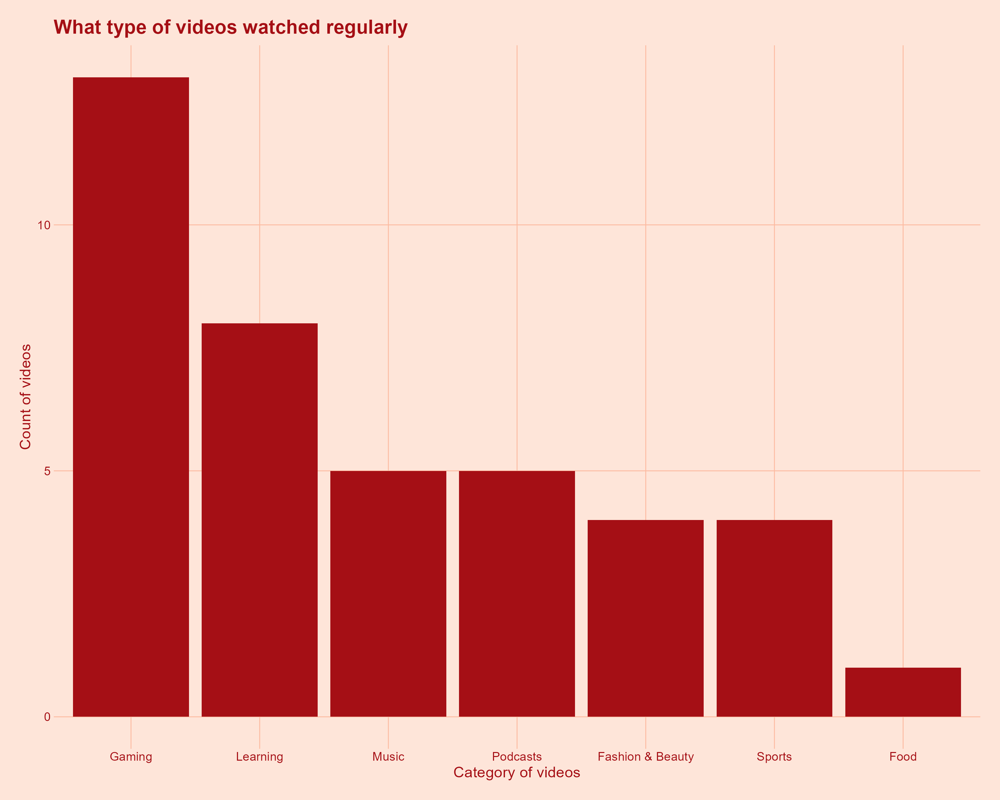
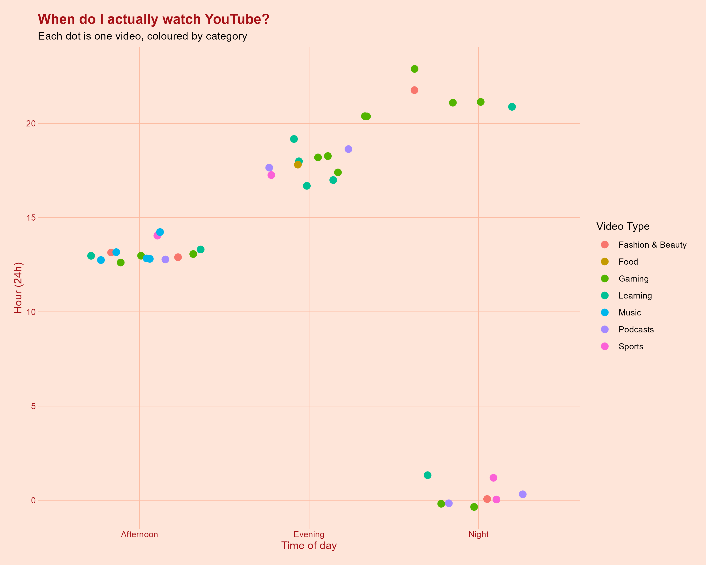
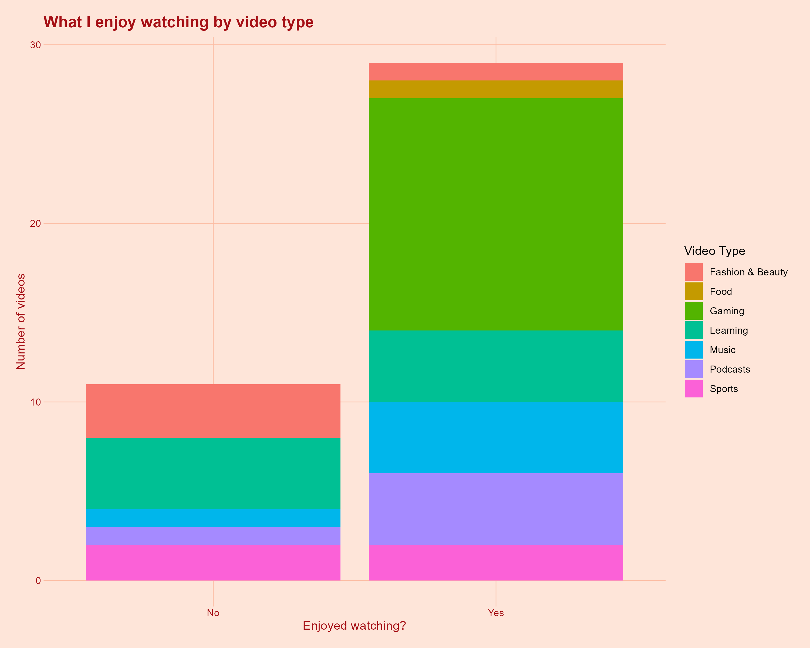

<script src="https://code.jquery.com/jquery-3.7.1.min.js" integrity="sha256-/JqT3SQfawRcv/BIHPThkBvs0OEvtFFmqPF/lYI/Cxo=" crossorigin="anonymous"></script>

```{r setup, include=FALSE}
knitr::opts_chunk$set(echo=FALSE, message=FALSE, warning=FALSE, error=FALSE)
```

```{js}
$(function() {
  $(".level2").css('visibility', 'hidden');
  $(".level2").first().css('visibility', 'visible');
  $(".container-fluid").height($(".container-fluid").height() + 300);
  $(window).on('scroll', function() {
    $('h2').each(function() {
      var h2Top = $(this).offset().top - $(window).scrollTop();
      var windowHeight = $(window).height();
      if (h2Top >= 0 && h2Top <= windowHeight / 2) {
        $(this).parent('div').css('visibility', 'visible');
      } else if (h2Top > windowHeight / 2) {
        $(this).parent('div').css('visibility', 'hidden');
      }
    });
  });
})
```

```{css, echo=FALSE}
body {
  background-color: #fee5d9;
  color: #252525;
  font-family: 'Helvetica', 'Arial', sans-serif;
  line-height: 1.6;
  max-width: 800px;
  margin: auto;
  padding: 2em;
}

h1.title {
  color: #a50f15;
  font-weight: bold;
  padding-bottom: 0.3em;
}

h2 {
  color: #a50f15;
  margin-top: 2em;
}

h3 {
  color: #de2d26;
}

p {
  color: #252525;
}

```

## Count of video types


This is a graph that I created using the bar graph. I wanted to know which video genre is what I watched the most. It seems like I really enjoy watching gaming and learning content. 

## When do I watch the videos


I chose a jitter plot for this next graph. I was wondering like when do I actually watched those videos. It seems like gaming videos are usually watched in the evening. This is probably because that's the time I actually wake up. I actually didn't realize that I listen to lots of music in the morning. 

## A plot describing likes and dislikes


I chose a column graph that shows which types of video genres I favor the most. This graph seems to show I enjoy more than 50% of the videos I watch, according to this graph mostly I like gaming videos and dislike fashion & beauty maybe because I lack a sense of fashion. 


