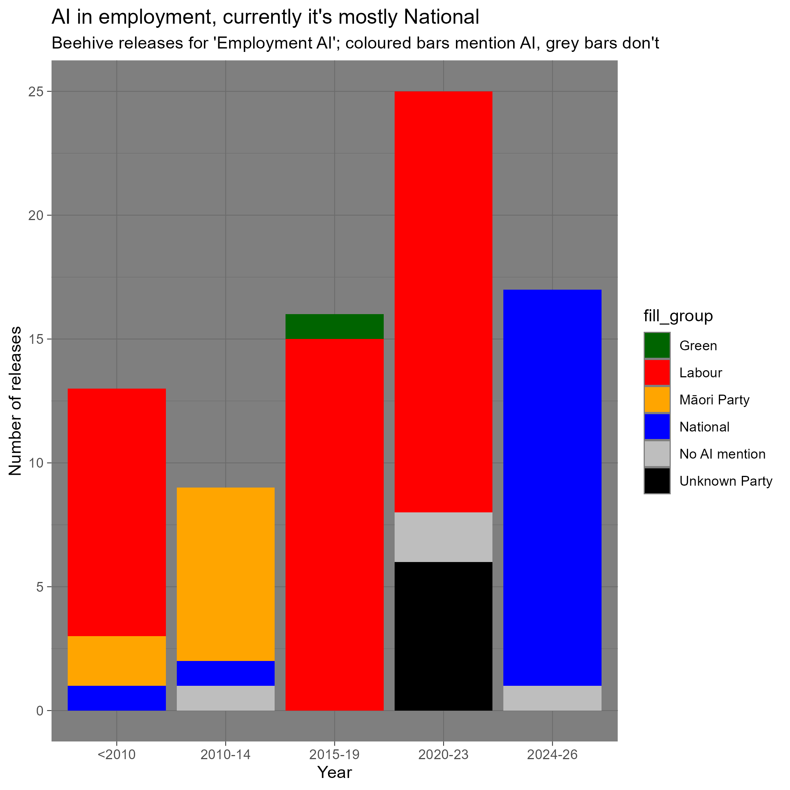

## Introduction
I decided to look at how the job market is being affected by AI using the keywords "AI" and "Employment" as my search terms on [The Beehive](https://www.beehive.govt.nz). As a Computer Science student, AI has heavily affected us the most recently most junior developers get laid off due to AI already being able to do what junior developers can do. 

Minister information was sourced from [Wikipedia](https://www.wikipedia.org).

According to the Beehive's [robots.txt](https://www.beehive.govt.nz/robots.txt), automated scraping of search result pages is permitted. The [copyright page](https://www.beehive.govt.nz/copyright) states that content on the site is protected under Crown copyright you are allowed to use and reproduce the material for personal or educational purposes, but you must not misrepresent the content or present it as your own.

## Visualisation
The visualisation shows the number of Beehive press releases related to employment and AI, grouped into year and coloured by which party the associated minister belongs to. Grey bars represent releases that do not mention AI at all, while coloured bars highlight releases where AI was detected in the title or summary. The year just shows how many times the word "AI" or "Artifical Intellegence" shows up. National Party ministers (blue) make up the bulk of AI-mentioning releases in the latest period, maybe due to AI being so popular.



## Creativity
I have created a variable with a bool (True/False) object which helps show a party. Initially I would just use a default theme and thought that would be good but noooo.... It just felt bland like plot wasn't that meaningful. I would use the bool variable AND regex to help me find if the title or summary contained the word ai or artificial intelligence. I had some hopes but not really as when I was going through the data I noticed that Maori words contain "ai" but with a different meaning, so that was a problem. I left it as it is and in the future we could use language detection to actually solve this problem. 

## Learning reflection
In this module I have learnt that we can just automatically scrape data from a saved web html instead of using an API. This is interesting because API have limit calls which means after a certain point we cannot access the API till our tokens refreshes.

Something I want to look further is how we can incorporate language detection into our data cleaning.

## Self review
Something I actually enjoyed creating was the ggplots "Create visualisations using {ggplot2}". One skill that I developed while doing my projects is VISUALISATION!! No matter what if I dont understand the dataplot, I plot it. Plotting it actually helps me try visualise what the data is actually telling. 
I also develop a keen sense of trying to keep my data clean, without clean data I don't think I would be able to complete my tasks. All data given was messy, but after joining STATS220 **this is not advertised** you will get to understand how to clean data and allow problems caused in our data to be fixed. *ahem not referring to something in creativity


## Appendix

```{r file='scrape_html.R', eval=FALSE, echo=TRUE}

```
```{r file='data_sources.R', eval=FALSE, echo=TRUE}

```
```{r file='visualisation.R', eval=FALSE, echo=TRUE}

```